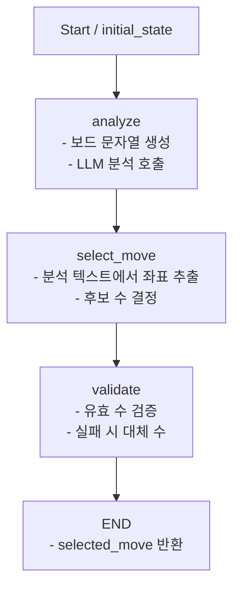

# LangGraphGomoku

LangGraph + Streamlit + Groq 기반의 AI 오목(19x19) 프로젝트입니다.

- 플레이어 vs AI 대전
- 보드 텍스처 + 바둑돌 이미지 지원
- 보드 이미지 위 교점을 직접 클릭해 착수
- LangGraph 워크플로우로 AI 수 선택
- AI 응답을 JSON 형식으로 파싱해 좌표를 안정적으로 선택
- 즉시 승리 수 / 즉시 차단 수는 규칙 기반으로 우선 처리

## 1. 프로젝트 개요

이 프로젝트는 오목 게임 로직과 LLM 기반 AI 의사결정을 결합한 실험용 앱입니다.

- 프론트엔드/UI: Streamlit
- AI 추론: LangChain + LangGraph + Groq
- 모델: `openai/gpt-oss-20b` (기본값)

## 2. 현재 주요 기능

- 19x19 보드 고정
- 보드 이미지를 정사각형으로 중앙 크롭 후 렌더링
- 보드 텍스처 위에 격자선 렌더링
- 돌은 교점 중앙에 배치
- 이미지 클릭 좌표를 교점으로 변환해 착수
- AI 수 계산 후 자동 응수
- 마지막 착수 위치를 빨간 원/점으로 강조 표시
- 최소 신뢰도 임계값을 조절해 낮은 신뢰도 수는 재고
- 오른쪽 패널에 게임 상태/안내를 분리 표시
- 왼쪽 사이드바에 게임 설정, LLM 생각, 히스토리 표시

## 3. 디렉터리 구조

```text
LangGraphGomoku/
├─ app.py                 # Streamlit 앱 엔트리
├─ board_ui.py            # 보드 렌더링/클릭 처리/UI 에셋 로딩
├─ game.py                # 오목 규칙/승패 판정/유효 수 계산
├─ ai_agent.py            # LangGraph 기반 AI 워크플로우
├─ requirements.txt       # 의존성 목록
├─ .env                   # API 키
└─ assets/
	├─ board.png           # 선택: 보드 텍스처
	├─ black_stone.png     # 선택: 검은 돌
	└─ white_stone.png     # 선택: 흰 돌
```

## 4. 설치 방법

프로젝트 루트에서 실행:

```powershell
python -m venv .venv
.\.venv\Scripts\python.exe -m pip install -r requirements.txt
```

## 5. 환경 변수 설정

`.env` 파일에 Groq API 키를 설정하세요.

```env
GROQ_API_KEY=your_groq_api_key_here
```

## 6. 실행 방법

반드시 프로젝트 폴더에서 실행:

```powershell
cd e:\workspace\LangGraphGomoku
.\.venv\Scripts\python.exe -m streamlit run app.py
```

브라우저 기본 주소:

- http://localhost:8501

## 7. 보드/돌 이미지 커스터마이징

`assets` 폴더에 아래 파일을 넣으면 자동 반영됩니다.

- `assets/board.png` (권장 정사각형, 예: 1200x1200)
- `assets/black_stone.png` (투명 PNG)
- `assets/white_stone.png` (투명 PNG)

파일이 없으면 코드에서 기본 이미지를 생성해 사용합니다.

## 8. AI 동작 구조

`ai_agent.py`의 LangGraph 흐름:

1. `analyze`: 현재 보드 텍스트를 모델에 전달해 분석 생성
2. `select_move`: 분석 문자열에서 JSON의 `recommended_move`를 우선 추출
3. `validate`: 유효 수인지 확인, 아니면 대체 수 선택

추가로 LLM 호출 전에 아래 규칙 기반 탐색을 먼저 수행합니다.

- AI가 한 수에 즉시 이길 수 있으면 그 수를 바로 선택
- 플레이어가 한 수에 즉시 이길 수 있으면 그 수를 차단하는 수를 우선 선택
- 규칙 기반으로 결정되지 않을 때만 LangGraph + LLM 분석을 사용

### AI 응답 규격

LLM은 아래 JSON 구조를 반환하도록 유도합니다.

```json
{
	"threat": "플레이어 위협 요약",
	"opportunity": "AI 공격 기회 요약",
	"recommended_move": {"row": 0, "col": 0},
	"reason": "선택 이유",
	"confidence": 0.0,
	"final_move": "FINAL_MOVE: (row,col)"
}
```

파서는 다음 순서로 해석합니다.

1. JSON의 `recommended_move.row/col`
2. `FINAL_MOVE: (row,col)` 문자열
3. 일반 `(row,col)` 좌표 패턴

### LangGraph 노드 구조도



상태(`GomokuState`)에서 주요 필드 흐름:

- 입력: `board`, `board_size`, `valid_moves`
- 중간 산출: `analysis`
- 최종 산출: `selected_move`, `confidence`

## 9. 현재 한계 및 개선 포인트

- 여전히 LLM 자체의 오목 실력은 모델 출력 품질에 의존합니다.
- `valid_moves`를 일부만 보여주면(상위 10개) 전략 품질이 낮아질 수 있습니다.
- 복잡한 수읽기(쌍따내기, 패턴 탐색 등)는 별도 룰 엔진이 있으면 더 강해집니다.

추천 개선:

- LLM에는 후보 수 상위 N개 + 평가 기준만 요청
- JSON 강제 출력으로 파싱 안정화
- 게임 단계(초반/중반/종반)별 프롬프트 분리
- 오목 전략 문서를 임베딩해 RAG로 참고시키기
- 패턴 기반 룰 엔진을 추가해 LLM 호출 전 후보 수를 좁히기

## 12. UI 구성

- 왼쪽 사이드바: 게임 설정, 최소 신뢰도 임계값, 이동 히스토리, 에셋 업로드, LLM 생각
- 가운데: 오목 보드만 표시
- 오른쪽 패널: 게임 상태, 안내
- 마지막 수는 빨간 원/점으로 강조 표시

## 10. 트러블슈팅

### Q1. `streamlit run app.py`가 파일을 못 찾는 경우

원인: 현재 작업 디렉터리가 프로젝트 루트가 아님.

해결:

```powershell
cd e:\workspace\LangGraphGomoku
.\.venv\Scripts\python.exe -m streamlit run app.py
```

### Q2. `Import ... could not be resolved` 경고

원인: VS Code 인터프리터가 `.venv`가 아님.

해결: Python 인터프리터를 `LangGraphGomoku/.venv`로 변경.

### Q3. 클릭 위치와 착수 위치가 어긋나는 경우

원인: 이미지 표시 스케일/좌표 계산 불일치.

해결: 현재 구현은 표시 크기 기준 좌표를 사용하도록 보정되어 있습니다.

## 11. 의존성

핵심 패키지:

- `langchain`
- `langgraph`
- `langchain-groq`
- `langchain-community`
- `pydantic`
- `streamlit`
- `streamlit-image-coordinates==0.4.0`